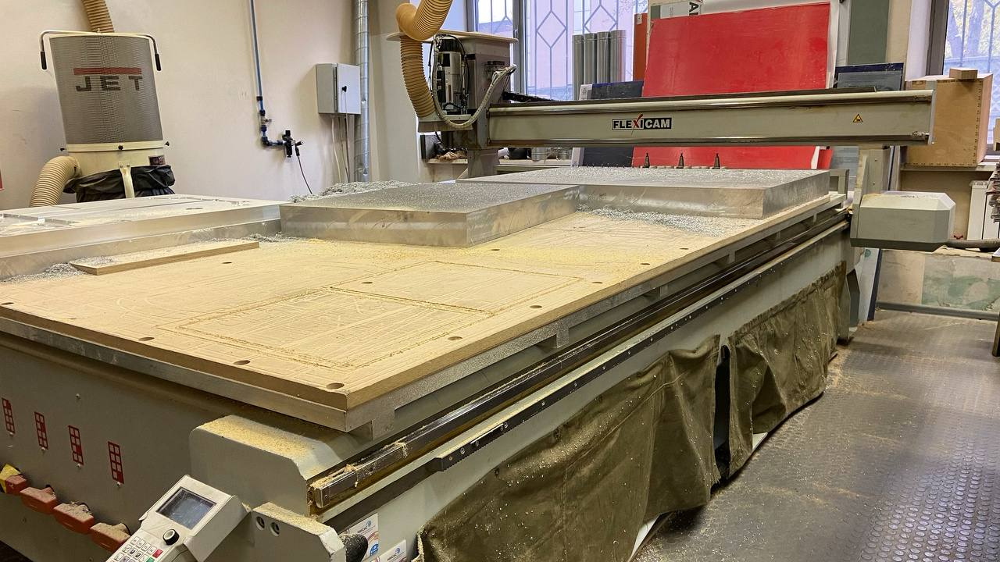

# PersonaLocker

Цель :

> — сделать персональный шкафчик с локером для хранение проектов ! 

*Этап работы :*

1.Сперва для шкафчика отфрезеровали дверцу из фанера с толщиной 6мм на фрезерном станке FlexiCAM ;

https://github.com/madinakhakimova/Own-locker/assets/144451345/c7d60891-044c-4099-8c27-1783710328bf

1.1.Обработала края на шлифовальном машинке.

2.Для фиксации двери было напечатано 2 [петли](https://github.com/madinakhakimova/Own-locker/tree/main/CAD) на 3D принтере

2.1.Для сборки петли использовано болты и гайки с размером М4 

2.2.После того определение размера для фиксации петли , петля зафиксировано на дверцу с помощью шурупа 

2.3.Чек-уп петли как после фиксации на дверцу 

https://github.com/madinakhakimova/Own-locker/assets/144451345/04e25690-5562-4a4c-8f9a-6f21d99ee6ab

3.При помощи трафарета и аэрозольных красок сделано индексация двери , после того на лазерном станке гравировано фамилия и имя

4.Для прикрепление соленоида напечатано STEP_сборка на 3D принтере !

8.Для подключение замка к RFID - считывателю были спаяны провода с длиной до панели RFID - считывателя 

https://github.com/madinakhakimova/Own-locker/assets/144451345/00b11fcd-a84d-4d6a-8a4d-cb376df6232d

9.RFID-аксессуар напечатано на 3D принтере в виде "фотоаппарат" , и на место объектива наклеен сам  RFID-метка

**Готовый шкафчик**

https://github.com/madinakhakimova/Own-locker/assets/144451345/ae28cfbb-8eb0-4a4e-95d1-ab51c5d739a3
